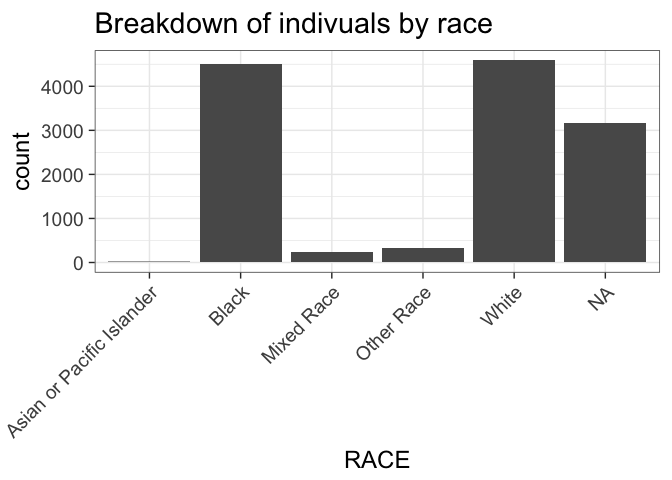
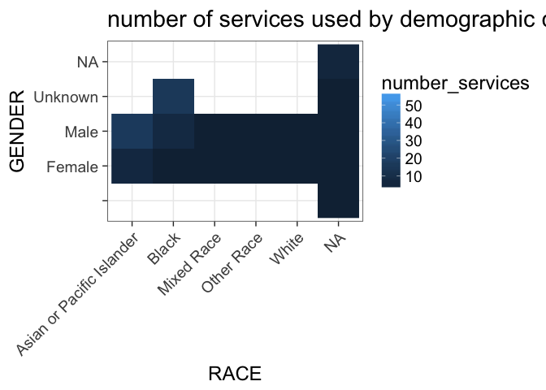

# Summarize Behavioral Health Dataset
Andrew Barr  
12/3/2016  


```r
library(dplyr)
library(ggplot2)
```

```
## Warning: package 'ggplot2' was built under R version 3.3.2
```

```r
theme_set(theme_bw(18))
```

## Load datasets


```r
behave <- data.table::fread("Behavioral Health Services.csv", header = T, sep=",")
```

```
## 
Read 97.7% of 1003167 rows
Read 1003167 rows and 17 (of 17) columns from 0.177 GB file in 00:00:03
```

```r
CYF <- data.table::fread("CYF Active 2010 to 2016-11-09(1).csv", header = T, sep=",")
```

First thought was to join these two datasets, but that is difficult because the CYF dataset it 1 row = 1 enounter, not 1 row = 1 person. 

First step must be to create a look-up table for demographic information derived from the CYF dataset. 

Some variables are not unique to each MCI_ID in this dataset....so they are not included in the `demog` dataset. Excluded vars are `CAS_ID`, `CL_ID`, `INVLV_STRT_DT`, `INVLV_END_DT`.  The `AGE` column was discarded because it changes based on encounter date. 


```r
demog <- 
  CYF %>%
    filter(MCI_ID != 0) %>%
    group_by(MCI_ID) %>%
    summarize(
      BRTH_DT = unique(BRTH_DT),
      GENDER = unique(GENDER),
      RACE = unique(RACE))
```

## Race categorizations

Recoded race categories to simplify


```r
race <- read.table("RaceReCategorizations_BehavioralDataset.csv", header=T, sep=",")
demog <- dplyr::left_join(demog, race, by=c("RACE" = "OriginalRace"))
```

```
## Warning in left_join_impl(x, y, by$x, by$y, suffix$x, suffix$y): joining
## factor and character vector, coercing into character vector
```

## Join behave and demog datasets


```r
behave <- left_join(behave, demog, by=c("MCI_UNIQ_ID" = "MCI_ID"))

behave$SVC_START_DT <- as.Date(behave$SVC_START_DT)
behave$SVC_END_DT <- as.Date(behave$SVC_END_DT)

rm(joined)
```

```
## Warning in rm(joined): object 'joined' not found
```

```r
rm(demog)
rm(CYF)
```

## Summarize encounters with behavioral health

* Total duration in days of service
* Number of different types of services


```r
summary_behave <- 
  behave %>% 
  mutate(encounter_duration=as.numeric(SVC_END_DT - SVC_START_DT)+1) %>%
  group_by(MCI_UNIQ_ID) %>%
  summarize(total_service_duration = sum(encounter_duration, na.rm=T), 
            number_services = length(unique(SERVICE_CODE)),
            RACE = unique(SimplifiedRace), 
            BRTH_DT = unique(BRTH_DT),
            GENDER = unique(GENDER))
```

## Demographic summaries


```r
ggplot(summary_behave, aes(x=RACE)) + 
  geom_bar() + 
  theme(axis.text.x = element_text(angle = 45, hjust = 1)) + 
  labs(title="Breakdown of indivuals by race")
```

<!-- -->


```r
ggplot(summary_behave, aes(x=RACE, y=GENDER, fill=number_services)) +
  geom_raster() + 
  labs(title="number of services used by demographic category") + 
  theme(axis.text.x = element_text(angle = 45, hjust = 1))
```

<!-- -->
